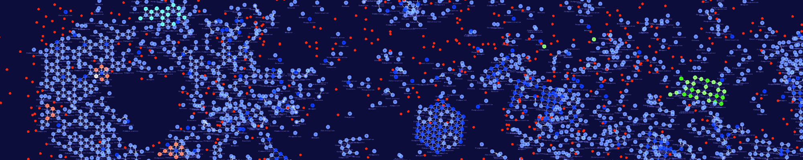

# CSS_Alien

This repository contains data and code used for the final project of the Complex Systems Simulation course of the UvA 2021. The program used for the simulations is the ALiEn-project: https://alien-project.org/index.html

In this repository you will find different folders containing setups needed in order to run the simulations used for our project. Furthermore, data extracted during these simulations is found in the [Data](https://github.com/DCCdelang/CSS_Alien/tree/main/Data) folder. The [Pattern_data](https://github.com/DCCdelang/CSS_Alien/tree/main/Pattern_data) folder contains more in-depth data on simulations were for each 10 or 5 thousand iterations data was stored containing an overview on the species distributions. This information was used using an extra functionality that calculates the size of the repetitive species while also capturing them in a collection (.col) file, which in turn can be opened again in the model.

In the [Collections](https://github.com/DCCdelang/CSS_Alien/tree/main/Collections) and the [Simulations](https://github.com/DCCdelang/CSS_Alien/tree/main/Simulations) folder some configurations are found in order to run the simulations. Most data was created using the setup-OTS-02.sim simulations file with the Default parameter settings.

Lastly, for the data analysis the code can be found in the [Code](https://github.com/DCCdelang/CSS_Alien/tree/main/Code) folder and some plots in the [Plots](https://github.com/DCCdelang/CSS_Alien/tree/main/Plots) folder.

Contributors:

Alicja Grudnowska
Dante de Lang
Mengli Feng
Warwick Louw