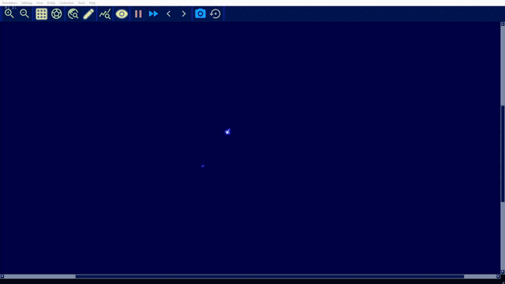
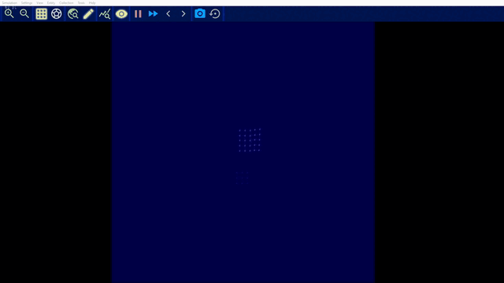
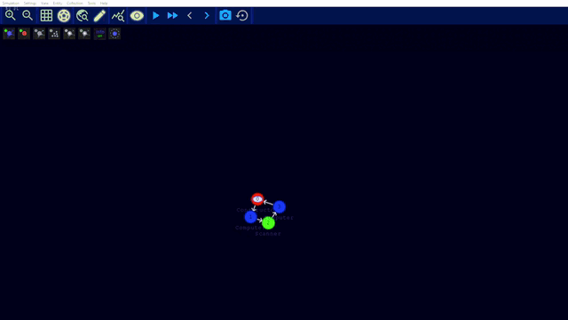

# Complex System Simulation - Artificial life

This repository contains data and code used for the final project of the Complex System Simulation course of the UvA 2021. The program used for the simulations is the ALiEn-project: https://alien-project.org/index.html

### Contents

In this repository you will find different folders containing setups needed in order to run the simulations used for our project. Furthermore, data extracted during these simulations is found in the [Data](https://github.com/DCCdelang/CSS_Alien/tree/main/Data) folder. For the general data every 200 msec data was gathered on the time step, number of clusters, number of clusters with tokens, number of cells, number of particles, number of tokens, total internal energy and the total kinetic energy.

The [Pattern_data](https://github.com/DCCdelang/CSS_Alien/tree/main/Pattern_data) folder contains more in-depth data on simulations were for each 10 or 5 thousand iterations data was stored containing an overview on the species distributions. This information was used using an extra functionality that calculates the size of the repetitive species while also capturing them in a collection (.col) file, which in turn can be opened again in the model.

In the [Collections](https://github.com/DCCdelang/CSS_Alien/tree/main/Collections) and the [Simulations](https://github.com/DCCdelang/CSS_Alien/tree/main/Simulations) folder some configurations are found in order to run the simulations. Most data was created using the setup-OTS-02.sim simulations file with the Default parameter settings.

In the above three images snapshots are shown of the setup-OTS-02.sim file with default parameters. The first file is at iteration=0 followed by a snapshot of iter=30k and iter=104k. While the simulation is initialized with only 10 small replicators it is very interesting to see how, in a nutrition rich environment, it is able to fully take over the simulation space. At 30k almost all food is converted and at 104k different clusters are emerging each consisting of different mutation of the original replicator. 

For further data analysis the code can be found in the [Code](https://github.com/DCCdelang/CSS_Alien/tree/main/Code) folder and some plots in the [Plots](https://github.com/DCCdelang/CSS_Alien/tree/main/Plots) folder. This analyses was done using both the general data and the pattern data.

#### **Custom Clusters**

The simulations of the custom clusters can be found in the following directory: [Simulations/Custom](Simulations/Custom).

**Cluster nutrient seeking behaviour**

The objective of this simulation was to understand how the sensor cell type works in combination with the
propulsion to enable a cluster to seek out nutrients and move towards them.

This can be found in the `seeker.sim` simulation, running the simulation should display the following:

**Cluster swarming behaviour**

By introducing many of the seeker clusters into a simulation with some nutrients, the seekers can exhibit some swarming behavior
even though they do not communicate with each other.

This can be found in the `swarm.sim` simulation, running the simulation should display the following:

**Cluster replication behaviour**

The purpose of the following simulation was to investigate how cluster replication could be introduced.

This can be found in the `replicator-sim.sim` simulation, running the simulation should display the following:

**Combined seeker and replicator behaviour**

Ultimately the goal was to create a simple cluster that could display both the seeker and replicator behaviour.
Unfortunately that turned out to be much harder than anticipated, eventually we contacted the author and the
best we could come up with was a cluster that sort-of combines both behaviour however it tends to gets stuck and only
exhibits replicator behaviour. When the token is removed from the cluster and a new token is introduced then
the cluster exhibits the seeker behaviour and not the replicator. I believe it would be possible to iron out
the bugs and create this cluster however we simply ran out of time.

The simulation can be found in the `rep-travel-combined-sim.sim` for anyone interested in diving more into this
cluster.

### How to execute a simulation

A build of the ALiEn project that was used for our research is available at [this link](http://alien-project.org/files/build_develop_branch.zip). This is a pre-build version which contains the executable necessary to open the program. When opening the program it is possible to load a simulation, there are off the shelf models available. 

A good start in order to get a grip of the program is going through the tutorials section in the new [documentation](https://alien-project.org/documentation/Introduction.html). Here it is also possible to download the simulations or clusters used in those tutorials.  Of course it is also possible to load the simulations that are available in the [Simulations](https://github.com/DCCdelang/CSS_Alien/tree/main/Simulations) folder. 

It is also possible to create your own simulation, this can be done by clicking new under the simulation menu button after which it becomes possible to adjust the general settings of the model (these can also be changed later). After initializing it is possible to load collections, these can also be existing .col files created by the author or one could choose to develop your own cell clusters. This becomes possible when you are zoomed in enough too see the controls below the menu bar. 

Another important aspect of the program can be found under settings > simulation parameters. Using this menu it becomes possible to alter a lot of parameters that can greatly influence the outcome of a simulation. These parameter settings can then also be saved independently in order to be used again in different simulations. 

For more information of the program it is best to consult the new [documentation](https://alien-project.org/documentation/Introduction.html) or the [website](https://alien-project.org/index.html).

### Minimal system requirements

An Nvidia graphics card with compute capability 6.0 or higher is needed. Please check https://en.wikipedia.org/wiki/CUDA#GPUs_supported.

For some graphics cards of the GeForce 10 series there are reported issues that are currently being investigated.

#### Contributors:

| Name | Student number |
|------|----------------|
| Alicja Grudnowska | 13060333 |
| Dante de Lang | 11014083 |
| Mengli Feng | 13260529 |
| Warwick Louw | 12594970 |
